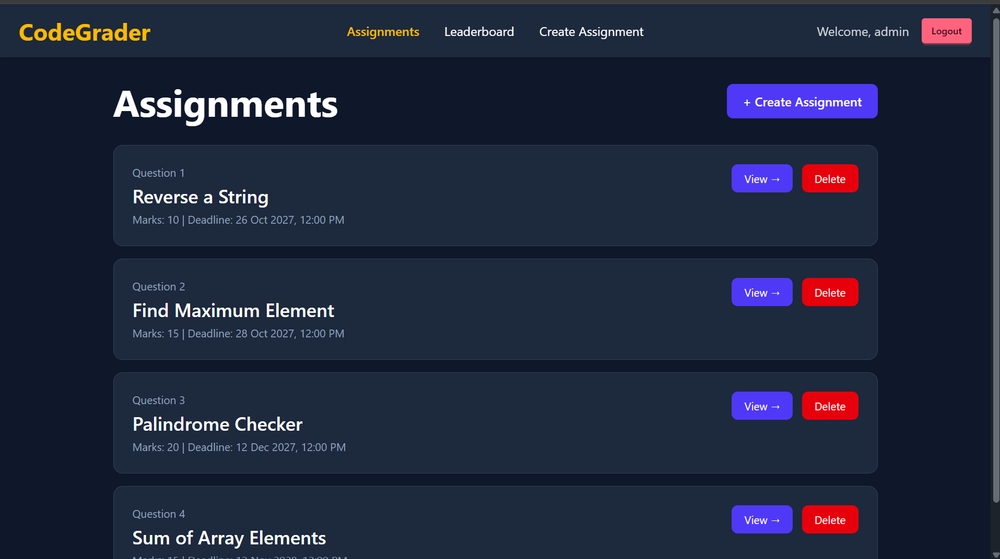
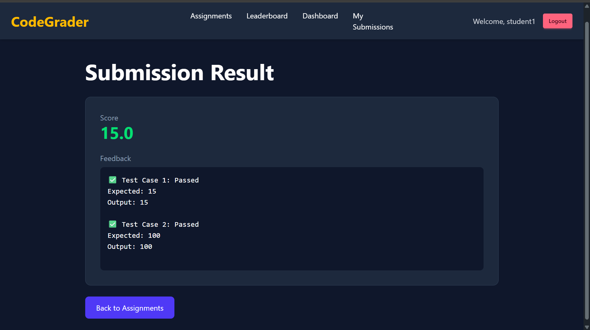
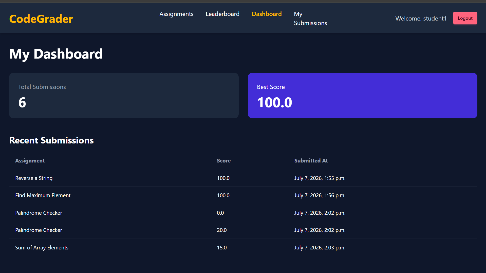

# CodeGrader

CodeGrader is an assignment management and automated grading platform built using Django and Tailwind CSS. It enables instructors to create assignments and test cases, while providing a foundation for automated code evaluation and instant feedback.

## Features

### Implemented

* Assignment Management

  * Create assignments
  * View assignment list
  * View assignment details

* Test Case Management

  * Create and manage test cases
  * Link test cases to assignments

* Student Submissions

  * Submit Python solutions
  * Store submission history

* Automated Evaluation

  * Execute Python code
  * Run against test cases
  * Compare outputs
  * Generate score automatically

* Result Dashboard
  
  * Pass/Fail status per testcase
  * Expected vs Actual output
  * Score calculation

* Submission History

  * View all previous submissions
  * Accepted/Failed status

* Modern UI

  * Tailwind CSS
  * Dark theme
  * Responsive layout

## Upcoming Features

* Leaderboard
* Authentication & Authorization
* Student Dashboard
* REST API
* Multi-language support (Python, C++, Java)
* Deployment

## Screenshots

### Assignment Dashboard



### Submission Result



### Submission History



## Tech Stack

* Python
* Django
* SQLite
* Tailwind CSS
* DaisyUI

## Project Structure

```text
CodeGrader/
│
├── assignments/
├── submissions/
├── templates/
├── static/
├── theme/
├── codegrader/
│
├── manage.py
├── requirements.txt
└── README.md
```

## Installation

```bash
git clone <repository-url>
cd CodeGrader

python -m venv venv

venv\Scripts\activate

pip install -r requirements.txt

python manage.py migrate

python manage.py runserver
```

Open:

```text
http://127.0.0.1:8000
```

## Current Status

🚧 Under Development

🚀 MVP Completed

### Completed
- Assignment Management
- Test Case Management
- Student Code Submission
- Automated Code Evaluation
- Instant Feedback & Scoring
- Submission History
- Leaderboard
- User Authentication (Register/Login/Logout)

### In Progress
- Role-Based Access Control
- Home Page & Navigation Improvements
- Deployment
